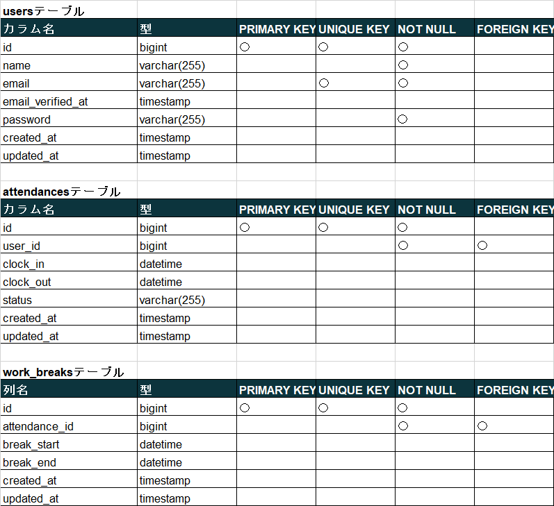
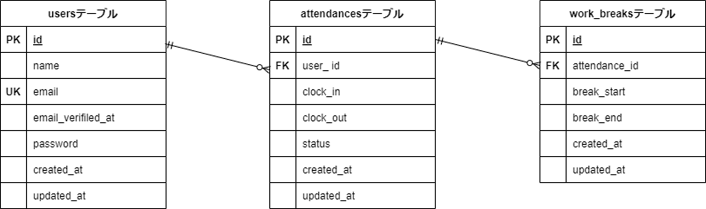

# アプリケーション名

勤怠管理システム
ログイン後、ボタン押下で勤務開始/終了時間と休憩開始/終了時間を管理します。

## 作成した目的

模擬案件を通して実践に近い開発経験を積むため。

## アプリケーション URL

## 機能一覧

ログイン機能、メール認証、勤務状態によるボタン制御、勤務時間/休憩時間管理、日付別勤怠管理、ユーザー一覧（各ユーザーのメールアドレスや登録日を表示。操作ボタン：勤怠表を押すと各ユーザーの勤怠表を閲覧できる）ユーザー別勤怠管理

## 使用技術（実行環境）

・PHP8.2
・Laravel8.83.27
・MySQL8.0.26

## テーブル設計

## ER 図

## 環境構築

Docker ビルド

git clone git@github.com:estra-inc/confirmation-test-contact-form.git
DockerDesktop アプリを立ち上げる
docker-compose up -d --build

Laravel 環境構築

docker-compose exec php bash
composer install
「.env.example」ファイルを 「.env」ファイルに命名を変更。または、新しく.env ファイルを作成
.env に以下の環境変数を追加
DB_CONNECTION=mysql
DB_HOST=mysql
DB_PORT=3306
DB_DATABASE=laravel_db
DB_USERNAME=laravel_user
DB_PASSWORD=laravel_pass

アプリケーションキーの作成
php artisan key:generate

マイグレーションの実行
php artisan migrate

## その他

アカウントは１００名（テストユーザー：山田太郎）
